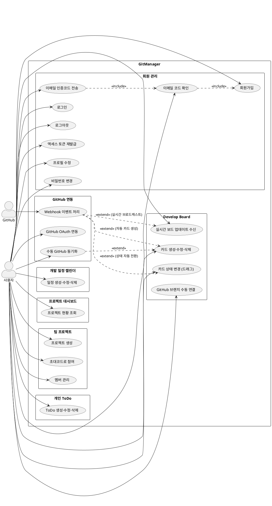
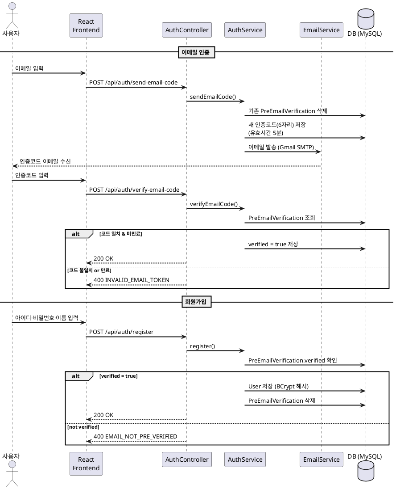
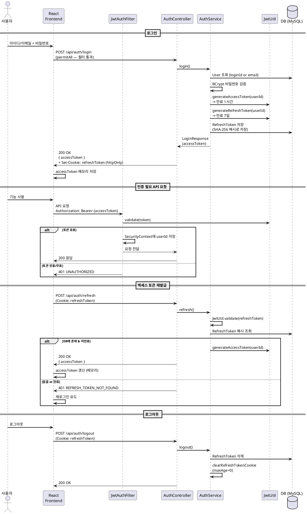
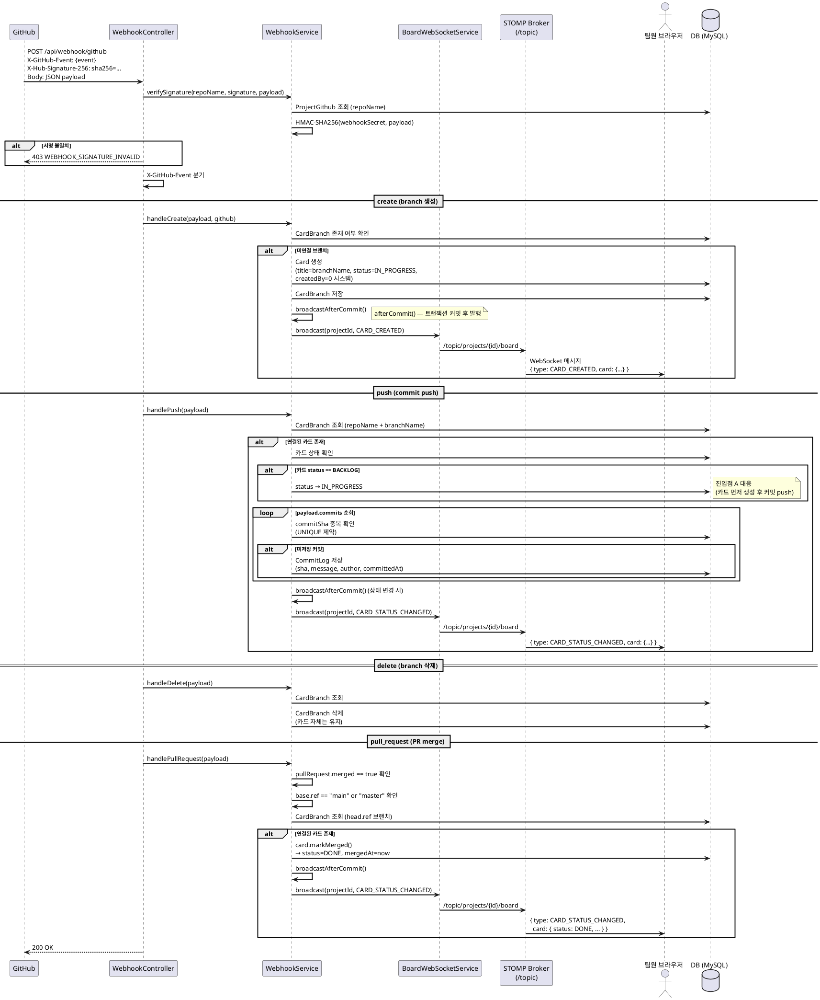
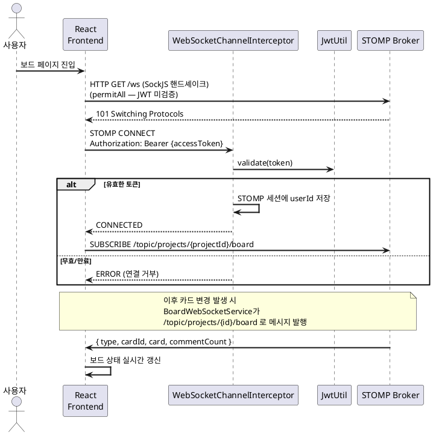

# UML 다이어그램

> PlantUML 형식. https://www.plantuml.com/plantuml 또는 IDE 플러그인으로 렌더링.

---

## 1. 사용자-기능 유스케이스 다이어그램

---

## 2. JWT 인증 시퀀스 다이어그램

### 2-1. 회원가입 흐름

### 2-2. 로그인 및 API 요청 흐름

---

## 3. GitHub Webhook 처리 시퀀스 다이어그램

---

## WebSocket 연결 시퀀스 (보드 접속)

